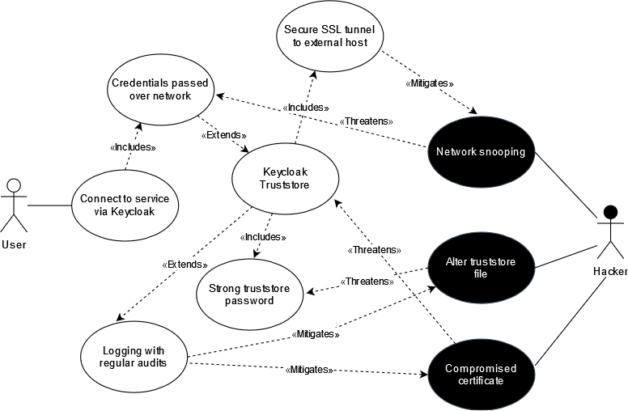

# Security Requirements Report
Team OneWon
## Essential Interactions, Diagrams, and Alignment Analysis

### Use Case 1: Implementing a Truststore

#### Description

The truststore is a foundational part of the Keycloak mechanism for remote connections.  Any Keycloak implementation that will connect to external systems will need the certificate of any external server to establish a secure SSL connection.  Remote server or Certificate Authority certificates must be stored in order to validate identity.  This validation is needed to prevent man-in-the-middle attacks.

#### Use Case

In this case, a user will connect to an external server using Keykloak.  Since credentials will be passed over the network or internet, packet interception is a risk to the user's credentials.  The user expects to connect to the external server without issue and without risk of credential theft.  The user believes proper care has been taken to configure the system and underlying security in order to connect to the expected endpoint.

##### Misuse Case

In reality, a hacker may attempt to monitor network traffic in order to capture credentials in transit.  A properly configured truststore will establish an encrypted SSL tunnel between endpoints which mitigates any potential network inspection by bad actors.  Keycloak will only connect to endpoints which match private keys stored locally in the trust store which mitigates the theat of a man-in-the-middle attack.
Alternatively, a hacker may gain access to the truststore if the Keycloak server is breached.  Using a strong truststore password will eliminate the possibly of the bad actor altering the truststore file.  Similarly, a security certificate must be swiftly revoked from the truststore should a remote server's certificate become compromised.  Regular logging and auditing will elimiate these potential security risks.

#### Security Requirement

The Keycloak truststore is created and maintained using the pre-built Java "keytool" utility, therefore the truststore utilizes the underlying security of "keytool".  The truststore password will be embedded into web applications that make use of the truststore for connection purposes.  Only administrators should have access to the embedded password, and robust system security is necessary to prevent external hackers from accessing the password.  Regular system logging and auditing should be conducted to monitor for any truststore changes.  Additionally, a file hash fingerprint should be recorded before and after any truststore changes to audit for any unrecorded changes to the file.

### Use Case 2

### Use Case 3

### Use Case 4

### Use Case 5

### Reflection on Security Requirements

## OSS Project Documention Review

## Overall Planning and Reflection
